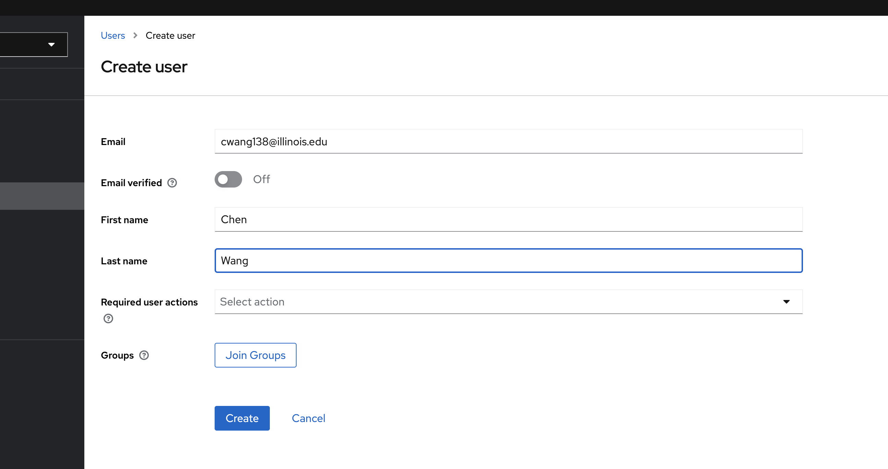

# Traefik with JWT validation plugin

This Docker Compose setup will start a stack consisting of Traefik, Keycloak, and GeoServer. GeoServer is protected by
Traefik with JWT validation enabled, meaning any request to the GeoServer endpoint will require an authorization token.
The JWT token can be provided in **cookies, headers, or query strings**.

We are using a Traefik plugin for JWT validation. The plugin allows for:

- Validation of JSON Web Tokens (JWT) in cookies, headers, and/or query string parameters for access control.
- Dynamic lookup of public keys from the well-known JWKS endpoint of whitelisted issuers.
- HTTP redirects for unauthorized and forbidden calls when configured in interactive mode.
- Flexible claim checks, including optional wildcards and Go template interpolation.

For more details about the plugin, visit
the [Traefik Dynamic JWT Validation Middleware plugin page](https://plugins.traefik.io/plugins/656cc22ece37949adf283080/dynamic-jwt-validation-middleware).

## Getting Started

### 1. Start Up the Stack


```bash
docker compose up
```

### 2. Accessing GeoServer

After the stack is running, try accessing GeoServer at:

```
http://localhost/geoserver
```

Or access any of the layer preview

```
http://localhost/geoserver/tiger/wms?service=WMS&version=1.1.0&request=GetMap&layers=tiger%3Agiant_polygon&bbox=-180.0%2C-90.0%2C180.0%2C90.0&width=768&height=384&srs=EPSG%3A4326&styles=&format=image%2Fjpeg
```

If no token is provided, you should receive a **"No token provided"** message.

### 3. Authenticating with JWT Token

#### 3.1 Create a User in Keycloak
Login to admin console with the following credentials:
```
username: admin
password: admin
```

Create a user in Keycloak with a username and password, for example:
- **Username**: (set your username e.g. cwang138@illinois.edu)
- **Password**: (set your own password)

Detail see below instructions:




#### 3.2 Obtain a JWT Token

Use the following `curl` command to obtain a JWT token for the user e.g. `cwang138@illinois.edu`:

```bash
curl --location --request POST 'http://localhost/keycloak/realms/dachub/protocol/openid-connect/token' \
--header 'Content-Type: application/x-www-form-urlencoded' \
--data-urlencode 'grant_type=password' \
--data-urlencode 'client_id=dachub-backend' \
--data-urlencode 'username=cwang138@illinois.edu' \
--data-urlencode 'password=your own password'
```

This command will return a JSON object containing the `access_token`. Copy the `access_token` value.

#### 3.3 Access GeoServer with JWT

Place the `access_token` in the cookie as follows:

- Cookie name: `authorization`
- Cookie value: `{access_token}` (replace `{access_token}` with the actual JWT token obtained from the previous step)

Now, try accessing GeoServer in the browser http://localhost/geoserver. You should be able to access the GeoServer resources without any issues.

Alternatively, you can place the `access_token` in the header and send the request as follows:
```bash
curl --location --request GET 'http://localhost/geoserver/tiger/wms?service=WMS&version=1.1.0&request=GetMap&layers=tiger%3Agiant_polygon&bbox=-180.0%2C-90.0%2C180.0%2C90.0&width=768&height=384&srs=EPSG%3A4326&styles=&format=image%2Fjpeg%0A' \
--header 'Authorization: {your access_token}

```

With the JWT token provided, you should be able to access the GeoServer resources without any issues.
